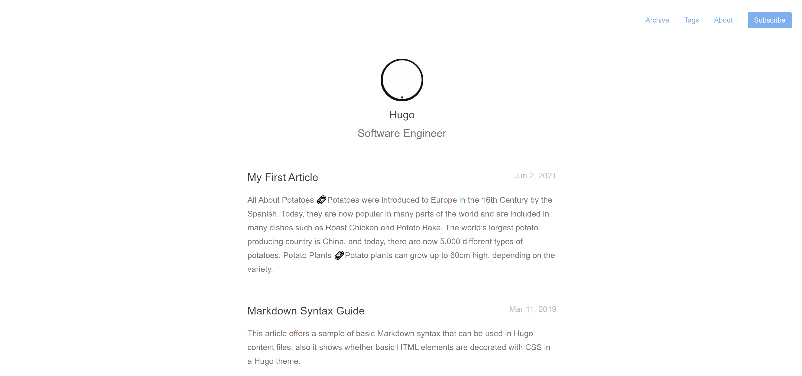

# mini-theme-hugo

[Sora](https://www.sorakhan.com/) and I presented at two meetups (Blast Furnace and Newcastle Coders Group) where we ran a tutorial on how to rapidly build a website using Hugo, and how to host that website with Github and Netlify.

In order to make it easier to follow, we created instructions that runs live at https://tutorial-blog.netlify.app/.

When you follow to the end of the tutorial, you yourself would have created your own hugo app, which should look identical to the final example: https://blast-furnace-hugo-example.netlify.app/

This Github is the code for the example site. 

## Blast Furnace 

* Thursday the 10th June - Blast Furnace Meetup - This was streamed to Youtube: https://www.youtube.com/watch?v=g5e5688qL-c&t=1932s.

## Newcastle Coders Group

* Wednesday 16th June - Newcastle Coders Group.

